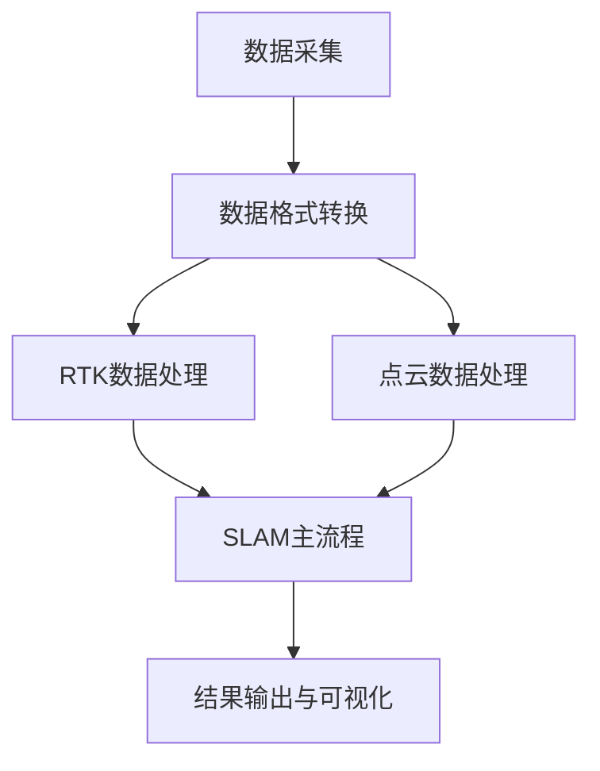
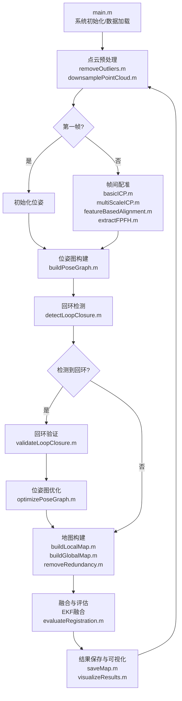

# IMU-SLAM（Lidar-ICP/NDT）-RTK 融合定位系统

## 项目背景

在移动机器人、无人车等领域，高精度的定位和环境感知是实现自主导航的关键。单一传感器（如RTK、IMU、激光雷达）存在各自的局限性，例如RTK在信号遮挡时定位失效，IMU存在漂移问题，激光雷达在特征缺失环境下配准精度下降。因此，多传感器融合成为解决这些问题的有效途径。本项目旨在通过融合RTK、IMU和激光雷达数据，实现高精度、鲁棒的定位与建图。

## 项目特色

1. **多传感器融合**

   - 创新性地将RTK、IMU和激光雷达数据进行融合
   - 采用EKF框架实现高精度定位
2. **算法优化**

   - 实现了基于FPFH特征的快速点云配准
   - 采用多尺度ICP提高配准精度
   - 设计了高效的回环检测机制
3. **工程实践**

   - 完整的工程实现，包括数据预处理、算法实现、结果可视化
   - 模块化设计，便于扩展和维护

## 项目逻辑与流程

### 典型流程图



1. **数据采集与预处理**

   - 采集IMU、激光雷达（Lidar）、RTK原始数据。
   - 使用 `rosbag2pcd` 目录下的Python脚本，将rosbag中的点云数据（PointCloud2）批量转换为PCD文件，并将数据转换为DAG格式，便于后续处理。
2. **RTK数据处理**

   - 在 `2012-01-22_sen` 目录下，对RTK原始数据进行解析，获得高精度的位置信息。
3. **SLAM主流程**

   - **IMU预积分**：对IMU原始数据进行预积分，获得高频的位姿预测。
   - **激光雷达配准**：采用ICP或NDT方法对连续帧点云进行配准，获得相对位姿变换。
   - **EKF融合**：将IMU预测、激光雷达配准结果与RTK定位信息，通过扩展卡尔曼滤波进行状态估计与优化，获得高精度的全局位姿。
4. **结果输出与可视化**

   - 输出最终的轨迹、点云地图等结果，并进行可视化展示。

## 应用场景

本项目的融合定位系统适用于多种场景，包括但不限于：

- **智能物流**：在仓库、园区等环境中，为AGV（自动导引车）提供高精度定位，实现货物的自动搬运和存储。
- **自动驾驶**：在城市道路、高速公路等场景下，辅助无人车进行精确的定位和导航，提高行车安全性。
- **测绘勘探**：在野外环境中，为测绘设备提供高精度的位置信息，实现地形地貌的快速测绘。

## 项目简介

本项目基于MATLAB实现，融合IMU、激光雷达（ICP/NDT方法）与RTK数据，采用扩展卡尔曼滤波（EKF）实现高精度的SLAM定位与姿态估计。适用于移动机器人、无人车等场景下的高精度定位需求。

## 项目结构

```
.
├── 2012-01-22_sen/                    # RTK部分相关代码与数据
│   ├── README.md                      # RTK部分说明文档
│   ├── ekf_main.m                     # EKF主程序
│   ├── run_ekf_2d.m                   # 2D EKF运行脚本
│   ├── load_nclt_data.m               # NCLT数据集加载
│   ├── read_nclt_data.m               # NCLT数据读取
│   ├── align_nclt_data.m              # NCLT数据对齐
│   ├── aligin_nclt_data_main.m        # 数据对齐主程序
│   ├── timestamp.m                    # 时间戳处理
│   ├── sensor_data.mat                # 传感器数据
│   ├── aligned_data.mat               # 对齐后的数据
│   ├── ekf_trajectory.csv             # EKF轨迹输出
│   └── output.jpg                     # 结果可视化
│
├── light-slam/                        # SLAM部分主目录
│   ├── rosbag2pcd/                    # rosbag数据处理与点云转换
│   │   ├── main.m                     # 主程序入口
│   │   ├── rosbag2pcd.m               # rosbag转pcd实现
│   │   └── sensordata_to_rosbag_fastlio.py  # 传感器数据转rosbag
│   │
│   ├── data/                         # 数据目录
│   ├── output/                       # 输出目录
│   ├── results/                      # 结果目录
│   │
│   ├── main.m                        # SLAM主程序入口
│   ├── runICPSLAM.m                  # ICP-SLAM实现
│   ├── featureBasedAlignment.m       # 基于特征的配准
│   ├── extractFPFH.m                 # FPFH特征提取
│   ├── visualizeResults.m            # 结果可视化
│   ├── optimizePoseGraph.m           # 位姿图优化
│   ├── buildPoseGraph.m              # 构建位姿图
│   ├── buildGlobalMap.m              # 构建全局地图
│   ├── detectLoopClosure.m           # 回环检测
│   ├── removeOutliers.m              # 离群点去除
│   ├── downsamplePointCloud.m        # 点云降采样
│   ├── basicICP.m                    # 基础ICP实现
│   ├── multiScaleICP.m               # 多尺度ICP
│   ├── trackFrames.m                 # 帧间跟踪
│   ├── buildLocalMap.m               # 构建局部地图
│   ├── validateLoopClosure.m         # 回环验证
│   ├── saveMap.m                     # 地图保存
│   ├── removeRedundancy.m            # 冗余去除
│   ├── evaluateRegistration.m        # 配准评估
│   ├── loadPointCloudData.m          # 点云数据加载
│   └── loadPointCloudSequence.m      # 点云序列加载
│
└── README.md                         # 项目说明文档
```

## 数学原理与公式

### 1. IMU预积分

IMU测量模型：

$$
\begin{align*}
\mathbf{a}_m &= \mathbf{R}^T(\mathbf{a} - \mathbf{g}) + \mathbf{b}_a + \mathbf{n}_a \\
\boldsymbol{\omega}_m &= \boldsymbol{\omega} + \mathbf{b}_g + \mathbf{n}_g
\end{align*}
$$

其中，$\mathbf{a}_m$ 和 $\boldsymbol{\omega}_m$ 分别为加速度计和陀螺仪测量值，$\mathbf{b}_a, \mathbf{b}_g$ 为偏置，$\mathbf{n}_a, \mathbf{n}_g$ 为噪声。

IMU预积分用于在两帧之间高效地累积IMU测量，预测位姿变化。

### 2. 激光雷达点云配准（ICP）

### 3. 状态转移的离散化表达式

在扩展卡尔曼滤波（EKF）框架中，状态转移的离散化表达式用于描述系统状态随时间的变化。假设系统的连续时间状态方程为：

$$
\dot{\mathbf{x}}(t) = f(\mathbf{x}(t), \mathbf{u}(t), t) + \mathbf{w}(t)
$$

其中，$\mathbf{x}(t)$ 是系统状态向量，$\mathbf{u}(t)$ 是控制输入向量，$\mathbf{w}(t)$ 是过程噪声向量，且 $\mathbf{w}(t) \sim N(0, Q_c)$。

采用欧拉离散化方法，将连续时间状态方程离散化为：

$$
\mathbf{x}_{k+1} = \mathbf{x}_k + \Delta t \cdot f(\mathbf{x}_k, \mathbf{u}_k, t_k) + \mathbf{w}_k
$$

其中，$\Delta t$ 是采样时间间隔，$\mathbf{x}_k$ 和 $\mathbf{x}_{k+1}$ 分别是时刻 $k$ 和 $k+1$ 的系统状态向量，$\mathbf{u}_k$ 是时刻 $k$ 的控制输入向量，$\mathbf{w}_k$ 是离散化后的过程噪声向量，且 $\mathbf{w}_k \sim N(0, Q_d)$，$Q_d = \Delta t \cdot Q_c$。

**ICP（Iterative Closest Point）**

ICP是一种经典的点云配准算法，其基本思想是通过不断迭代，最小化两帧点云之间的欧氏距离，从而求解最优的刚性变换（旋转R和平移t）。ICP的主要流程如下：

1. 初始对齐：给定源点云和目标点云的初始相对位姿。
2. 最近邻搜索：对于源点云中的每个点，找到目标点云中最近的点作为对应点。
3. 变换估计：基于所有对应点对，计算最优的旋转矩阵R和平移向量t，使得整体配准误差最小。
4. 应用变换：将源点云应用当前估计的变换。
5. 迭代优化：重复步骤2-4，直到收敛（误差变化小于阈值或达到最大迭代次数）。

   数学公式：

### 目标函数

ICP 的核心目标是找到一个旋转矩阵 $R \in SO(3)$（三维特殊正交群）和平移向量 $\mathbf{t} \in \mathbb{R}^3$，使得源点云 $\mathbf{P} = \{ \mathbf{p}_i \}_{i=1}^N$ 与目标点云 $\mathbf{Q} = \{ \mathbf{q}_i \}_{i=1}^N$ 之间的误差平方和最小。目标函数可以表示为：

$$
E(R, \mathbf{t}) = \min_{R, \mathbf{t}} \sum_{i=1}^N \| R \mathbf{p}_i + \mathbf{t} - \mathbf{q}_{i}^{*} \|^2
$$

其中，$\mathbf{p}_i$ 是源点云 $\mathbf{P}$ 中的第 $i$ 个点，$\mathbf{q}_{i}^{*}$ 是目标点云 $\mathbf{Q}$ 中与 $\mathbf{p}_i$ 最近的对应点，$\| \cdot \|$ 表示欧几里得范数。

#### 1. 初始对齐

假设初始的相对位姿由旋转矩阵 $R_0$ 和平移向量 $\mathbf{t}_0$ 表示，则源点云的初始变换为：

$$
\mathbf{p}_i^{\prime} = R_0 \mathbf{p}_i + \mathbf{t}_0
$$

#### 2. 最近邻搜索

对于每个变换后的源点 $\mathbf{p}_i^{\prime}$，在目标点云 $\mathbf{Q}$ 中找到最近的点 $\mathbf{q}_{i}^{*}$，即：

$$
\mathbf{q}_{i}^{*} = \arg\min_{\mathbf{q}_j \in \mathbf{Q}} \| \mathbf{p}_i^{\prime} - \mathbf{q}_j \|^2
$$

#### 3. 变换估计

通过奇异值分解（SVD）方法求解最优的旋转矩阵 $R$ 和平移向量 $\mathbf{t}$。首先计算源点云和对应点云的质心：

$$
\mathbf{p}_{\mathrm{mean}} = \frac{1}{N} \sum_{i=1}^N \mathbf{p}_i
$$

$$
\mathbf{q}_{\mathrm{mean}} = \frac{1}{N} \sum_{i=1}^N \mathbf{q}_{i}^{*}
$$

然后计算协方差矩阵 $H$：

$$
H = \sum_{i=1}^N (\mathbf{p}_i - \mathbf{p}_{\mathrm{mean}}) (\mathbf{q}_{i}^{*} - \mathbf{q}_{\mathrm{mean}})^T
$$

对 $H$ 进行 SVD 分解：$H = U \Sigma V^T$，则最优的旋转矩阵 $R$ 为：

$$
R = V U^T
$$

最优的平移向量 $\mathbf{t}$ 为：

$$
\mathbf{t} = \mathbf{q}_{\mathrm{mean}} - R \mathbf{p}_{\mathrm{mean}}
$$

#### 4. 应用变换

将源点云 $\mathbf{P}$ 应用当前估计的变换 $(R, \mathbf{t})$：

$$
\mathbf{p}_i^{\prime} = R \mathbf{p}_i + \mathbf{t}
$$

#### 5. 迭代优化

重复步骤 2 - 4，直到满足收敛条件。收敛条件通常可以表示为误差变化小于某个阈值 $\epsilon$ 或达到最大迭代次数 $k_{\max}$：

$$
| E(R_{k}, \mathbf{t}_{k}) - E(R_{k-1}, \mathbf{t}_{k-1}) | < \epsilon \quad \text{或} \quad k \geq k_{\max}
$$

其中，$k$ 表示当前迭代次数。

### 3. RTK定位

RTK（Real-Time Kinematic）通过载波相位差分实现厘米级定位精度。其核心为基站与移动站之间的双差观测方程。

### 4. 扩展卡尔曼滤波（EKF）融合

系统状态向量：

$$
\mathbf{x} = [\mathbf{p}, \mathbf{v}, \mathbf{q}, \mathbf{b}_a, \mathbf{b}_g]
$$

其中，$\mathbf{p}$ 为位置，$\mathbf{v}$ 为速度，$\mathbf{q}$ 为四元数姿态，$\mathbf{b}_a, \mathbf{b}_g$ 为IMU偏置。

EKF预测与更新方程：

- 预测：

$$
\mathbf{x}_{k|k-1} = f(\mathbf{x}_{k-1}, \mathbf{u}_{k-1})
$$

$$
\mathbf{P}_{k|k-1} = \mathbf{F}_{k-1} \mathbf{P}_{k-1} \mathbf{F}_{k-1}^T + \mathbf{Q}_{k-1}
$$

- 更新：

$$
\mathbf{K}_k = \mathbf{P}_{k|k-1} \mathbf{H}_k^T (\mathbf{H}_k \mathbf{P}_{k|k-1} \mathbf{H}_k^T + \mathbf{R}_k)^{-1}
$$

$$
\mathbf{x}_k = \mathbf{x}_{k|k-1} + \mathbf{K}_k (\mathbf{z}_k - h(\mathbf{x}_{k|k-1}))
$$

$$
\mathbf{P}_k = (\mathbf{I} - \mathbf{K}_k \mathbf{H}_k) \mathbf{P}_{k|k-1}
$$

## 环境依赖

- MATLAB R2018b及以上版本
- Python 3.x（用于rosbag2pcd数据处理）
  - 依赖库：`rosbag`, `sensor_msgs`, `pcl`, `numpy`
- ROS（处理rosbag数据时）
- PCL（点云库）

## 操作步骤

### 1. 数据准备

- **IMU、激光雷达、RTK原始数据**：请确保你已经采集好原始数据，通常为rosbag格式（`.bag`），或原始文本/二进制文件。

### 2. 点云与数据格式转换

进入 `light-slam/rosbag2pcd` 目录，依次运行：

#### 2.1 `data2dag.py`

- **功能**：将rosbag中的传感器数据（如IMU、RTK、激光雷达）提取并转换为DAG格式，便于MATLAB读取和处理。
- **用法**：

  ```bash
  python sensordata_to_rosbag_fastlio.py --input your.bag --output output_folder/
  ```

  > 参数说明见脚本内注释。
  >

#### 2.2 `bag2pcd.py`

- **功能**：将rosbag中的PointCloud2消息批量转换为PCD文件，供SLAM算法使用。
- **用法**：
  ```bash
  rosbag2pcd.m
  ```

### 3. RTK数据处理

进入 `2012-01-22_sen` 目录，运行MATLAB脚本：

- **主要脚本**：如 `etk_main.m`
- **功能**：解析RTK原始数据，输出高精度定位结果（如经纬度、UTM坐标等）。
- **用法**：
  ```matlab
  ekf_main
  ```

### 4. SLAM主流程

进入 `light-slam` 目录，运行主SLAM脚本：

- **主脚本**：如 `main.m` 或 `slam_ekf.m`
- **功能**：完成IMU预积分、激光雷达配准（ICP/NDT）、EKF融合、轨迹与地图输出。
- **用法**：
  ```matlab
  main
  ```

### 5. 结果可视化

- 运行如 `plot_result.m` 等脚本，展示轨迹、点云地图等结果。

## 主要函数/脚本功能说明

### `2012-01-22_sen/` RTK部分

- **ekf_main.m**EKF主程序，实现RTK数据的EKF滤波处理。主要功能包括：

  - 初始化EKF状态向量和协方差矩阵
  - 实现预测步骤和更新步骤
  - 处理RTK观测数据
  - 输出滤波后的轨迹
- **run_ekf_2d.m**2D EKF运行脚本，用于处理平面运动场景。功能包括：

  - 加载传感器数据
  - 配置EKF参数
  - 运行2D EKF算法
  - 可视化结果
- **load_nclt_data.m**NCLT数据集加载函数，负责：

  - 读取NCLT格式的传感器数据
  - 数据预处理和格式转换
  - 时间戳对齐
- **align_nclt_data.m**NCLT数据对齐函数，实现：

  - 多传感器数据时间同步
  - 坐标系转换
  - 数据插值

### `light-slam/rosbag2pcd/` 数据处理部分

- **main.m**主程序入口，协调整个数据处理流程：

  - 调用rosbag2pcd转换
  - 数据格式验证
  - 错误处理
- **rosbag2pcd.m**rosbag转pcd实现，主要功能：

  - 读取rosbag文件
  - 提取点云数据
  - 转换为PCD格式
  - 保存点云文件
- **sensordata_to_rosbag_fastlio.py**传感器数据转rosbag脚本，实现：

  - 读取原始传感器数据
  - 转换为ROS消息格式
  - 生成rosbag文件

### `light-slam/` SLAM核心算法部分

**核心算法详细流程图：**



---

#### 1. main.m

- **功能**：作为 SLAM 系统的主入口，该模块承担着初始化系统所需参数的重要任务，这些参数包括传感器的标定参数、算法的运行参数等。同时，它负责从数据源加载点云、IMU 和 RTK 等数据，并在主循环中调度各个子模块按顺序执行，确保整个 SLAM 流程的顺畅运行。
- **输入**：
  - 配置参数：包含传感器的标定信息、算法的迭代次数、误差阈值等。
  - 点云数据：由激光雷达采集的环境三维点云信息。
  - IMU 数据：惯性测量单元提供的加速度和角速度信息，用于姿态估计。
  - RTK 数据：实时动态差分定位数据，提供高精度的位置信息。
- **输出**：
  - 最终轨迹：经过 SLAM 算法优化后的机器人运动轨迹。
  - 地图：构建的环境三维点云地图或栅格地图。
  - 评估结果：包括定位误差、建图精度等评估指标。
- **主要流程**：见上方伪代码和流程图，具体流程包括初始化参数、数据加载、数据预处理、前端里程计、后端优化、回环检测和地图构建等步骤。

---

#### 2. removeOutliers.m

- **功能**：在实际的激光雷达数据采集过程中，由于环境噪声、传感器故障等因素，点云数据中可能会存在离群点，这些离群点会影响后续的点云处理和 SLAM 算法的精度。该模块的主要功能就是通过特定的滤波算法去除这些离群点，提高点云数据的质量。
- **输入**：原始的点云数据，通常以三维坐标 $(x, y, z)$ 的形式存储。
- **输出**：去除离群点后的点云数据，同样以三维坐标的形式存储。
- **常用方法**：
  - 统计滤波：通过计算每个点的邻域内的点数，根据统计规律判断该点是否为离群点。
  - 半径滤波：检查每个点在指定半径内的点数，若点数少于阈值，则认为该点是离群点。
- **公式**（统计滤波示例）：
  $$
  n_i = \text{邻域半径}~r~\text{内的点数} \\ 
  n_i < \text{阈值} \implies p_i~为离群点
  $$

  其中，$n_i$ 表示第 $i$ 个点在邻域半径 $r$ 内的点数，$p_i$ 表示第 $i$ 个点。

---

#### 3. downsamplePointCloud.m

- **功能**：原始的点云数据通常包含大量的点，这会增加后续处理的计算量和存储成本。点云降采样模块的主要功能是在不损失太多有用信息的前提下，减少点云数据的点数，提高处理效率。
- **输入**：原始的点云数据，以三维坐标的形式存储。
- **输出**：降采样后的点云数据，点数明显减少，但仍然能够保留原始点云的主要特征。
- **常用方法**：体素网格滤波，将点云空间划分为若干个小的三维体素网格，每个体素内的点用一个代表点来代替。

  通常，代表点可以选择体素内所有点的质心。

---

#### 4. basicICP.m / multiScaleICP.m

- **功能**：点云帧间配准是 SLAM 前端里程计的核心任务之一，该模块的主要功能是通过计算相邻两帧点云之间的相对位姿，从而得到机器人的运动信息。具体来说，就是找到一个最优的变换矩阵，将源点云变换到与目标点云对齐的位置。
- **输入**：
  - 源点云：通常是当前时刻采集到的点云数据。
  - 目标点云：可以是上一时刻采集到的点云数据，也可以是经过处理后的全局地图。
- **输出**：变换矩阵 $T$，它包含旋转矩阵 $R$ 和平移向量 $t$，用于将源点云变换到目标点云的坐标系下。
- **核心公式**（ICP）：
  $$
  \min_{R, t} \sum_{i=1}^N \| R \mathbf{p}_i + \mathbf{t} - \mathbf{q}_i \|^2
  $$

  其中，$\mathbf{p}_i$ 为源点云中的第 $i$ 个点，$\mathbf{q}_i$ 为目标点云中的对应点，$R$ 为旋转矩阵，$t$ 为平移向量。该公式的目标是找到最优的 $R$ 和 $t$，使得源点云和目标点云之间的对应点的误差平方和最小。
- **multiScaleICP**：多分辨率下重复 ICP 算法，先在低分辨率的点云上进行粗配准，得到一个初始的变换矩阵，然后在高分辨率的点云上进行细配准，进一步优化变换矩阵，从而提高配准的精度和效率。

---

#### 5. featureBasedAlignment.m + extractFPFH.m

- **功能**：在点云配准过程中，直接使用原始点云进行配准可能会受到噪声、遮挡等因素的影响，导致配准精度不高。基于 FPFH（Fast Point Feature Histograms）等特征的点云配准模块，通过提取点云的局部特征，利用这些特征进行配准，能够提高配准的鲁棒性和精度。
- **输入**：
  - 源点云：需要进行配准的点云数据。
  - 目标点云：作为配准参考的点云数据。
- **输出**：两帧点云之间的相对变换矩阵，用于将源点云变换到与目标点云对齐的位置。
- **FPFH 特征提取公式**：
  $$
  \mathrm{FPFH}(\mathbf{p}) = \frac{1}{|\mathcal{N}(\mathbf{p})|} \sum_{\mathbf{q} \in \mathcal{N}(\mathbf{p})} \mathrm{SPFH}(\mathbf{q})
  $$

  其中，$\mathcal{N}(\mathbf{p})$ 为点 $\mathbf{p}$ 的邻域，$|\mathcal{N}(\mathbf{p})|$ 表示邻域内点的数量，$\mathrm{SPFH}(\mathbf{q})$ 为邻域内点 $\mathbf{q}$ 的单点特征直方图。FPFH 特征是通过对邻域内所有点的 SPFH 特征进行加权平均得到的，它能够描述点云的局部几何特征。

---

#### 6. buildPoseGraph.m

- **功能**：位姿图是 SLAM 后端优化中常用的一种数据结构，该模块的主要功能是根据每帧的位姿信息和回环检测信息，构建一个位姿图，用于后续的全局优化。位姿图由节点和边组成，节点表示机器人在不同时刻的位姿，边表示节点之间的约束关系。
- **输入**：
  - 每帧位姿：机器人在不同时刻的位姿信息，通常用旋转矩阵 $R$ 和平移向量 $t$ 表示。
  - 回环信息：通过回环检测模块得到的机器人回到之前位置的信息，用于构建回环约束。
- **输出**：位姿图数据结构，包含节点和边的信息，用于后续的全局优化。
- **公式**（节点/边）：
  $$
  \mathbf{x}_i = [R_i, \mathbf{t}_i] \\ 
  \mathbf{e}_{ij} = \mathbf{x}_j \ominus (\mathbf{x}_i \oplus \mathbf{z}_{ij})
  $$

  其中，$\mathbf{x}_i$ 表示第 $i$ 个节点的位姿，$R_i$ 为旋转矩阵，$\mathbf{t}_i$ 为平移向量；$\oplus$ 表示位姿叠加，$\ominus$ 表示位姿差分，$\mathbf{z}_{ij}$ 为从节点 $i$ 到节点 $j$ 的观测约束。误差项 $\mathbf{e}_{ij}$ 表示节点 $j$ 的实际位姿与根据节点 $i$ 和观测约束 $\mathbf{z}_{ij}$ 预测的位姿之间的差异。

---

#### 7. detectLoopClosure.m

- **功能**：回环检测是 SLAM 系统中的关键模块之一，其主要功能是检测机器人是否回到了之前访问过的位置。如果检测到回环，可以利用回环信息对全局位姿进行优化，从而减少累积误差，提高地图的一致性和精度。
- **输入**：
  - 当前帧与历史帧的点云：用于比较当前位置和历史位置的环境特征。
  - 当前帧与历史帧的位姿：辅助判断机器人的运动轨迹，提高回环检测的效率。
- **输出**：回环候选对，即可能存在回环关系的当前帧和历史帧的组合。
- **常用方法**：
  - 距离阈值：通过比较当前帧和历史帧的位姿之间的距离，当距离小于设定的阈值时，认为可能存在回环。
  - 特征直方图匹配：提取点云的特征直方图，比较当前帧和历史帧的特征直方图的相似度，当相似度高于设定的阈值时，认为可能存在回环。

---

#### 8. validateLoopClosure.m

- **功能**：在回环检测模块得到回环候选对后，需要对这些候选对进行验证，以确定是否真的存在回环。回环验证模块的主要功能就是通过计算回环候选帧之间的配准误差，判断回环是否有效，从而避免误判。
- **输入**：回环候选帧的点云和位姿，用于计算两帧之间的变换矩阵。
- **输出**：回环有效性判断，通常以布尔值的形式表示，即判断回环是否有效。
- **公式**（配准误差）：
  $$
  e = \| T_{ij}^{\text{估计}} - T_{ij}^{\text{测量}} \|
  $$

  其中，$T_{ij}^{\text{估计}}$ 为通过点云配准算法估计得到的两帧之间的变换矩阵，$T_{ij}^{\text{测量}}$ 为根据位姿信息得到的两帧之间的变换矩阵。配准误差 $e$ 表示这两个变换矩阵之间的差异，当误差小于设定的阈值时，认为回环有效。

---

#### 9. optimizePoseGraph.m

- **功能**：在 SLAM 过程中，由于传感器噪声、累积误差等因素的影响，机器人的位姿估计可能会存在误差，导致地图出现漂移和不一致的问题。全局位姿图优化模块的主要功能是通过最小化位姿图中所有约束的误差平方和，对机器人的全局位姿进行优化，从而提高地图的精度和一致性。
- **输入**：位姿图，包含节点和边的信息，节点表示机器人在不同时刻的位姿，边表示节点之间的约束关系。
- **输出**：优化后的全局位姿，即经过优化后机器人在不同时刻的更准确的位姿。
- **核心公式**（非线性最小二乘）：
  $$
  \min_{\mathbf{x}} \sum_{(i,j) \in C} \| \mathbf{e}_{ij} \|^2
  $$

  其中，$\mathbf{x}$ 表示所有节点的位姿变量，$C$ 为所有约束的集合，$\mathbf{e}_{ij}$ 表示节点 $i$ 和节点 $j$ 之间的误差项。该公式的目标是找到一组最优的位姿变量 $\mathbf{x}$，使得所有约束的误差平方和最小。

---

#### 10. buildLocalMap.m / buildGlobalMap.m

- **功能**：构建局部/全局点云地图是 SLAM 系统的重要任务之一，该模块的主要功能是根据机器人的位姿信息，将不同时刻采集到的点云数据转换到全局坐标系下，并进行合并和融合，从而构建出完整的局部或全局点云地图。
- **输入**：
  - 点云：不同时刻采集到的环境三维点云数据。
  - 位姿：机器人在不同时刻的位姿信息，包括旋转矩阵 $R$ 和平移向量 $\mathbf{t}$。
- **输出**：地图点云，即经过坐标变换和合并后的局部或全局点云地图。
- **公式**（点云坐标变换）：
  $$
  \mathbf{p}_{\text{global}} = R \cdot \mathbf{p}_{\text{local}} + \mathbf{t}
  $$

  其中，$\mathbf{p}_{\text{local}}$ 为局部坐标系下的点云坐标，$\mathbf{p}_{\text{global}}$ 为全局坐标系下的点云坐标，$R$ 为旋转矩阵，$\mathbf{t}$ 为平移向量。该公式用于将局部坐标系下的点云数据转换到全局坐标系下。

---

#### 11. removeRedundancy.m

- **功能**：在点云数据采集和处理过程中，由于机器人的运动和传感器的重复扫描，点云数据中可能会存在大量的冗余点，这些冗余点会增加后续处理的计算量和存储成本。去除点云冗余模块的主要功能是通过重叠检测、体素滤波等方法，去除点云数据中的冗余点，提高点云数据的质量和处理效率。
- **输入**：原始的点云数据，以三维坐标的形式存储。
- **输出**：精简后的点云数据，去除了冗余点，点数明显减少，但仍然能够保留原始点云的主要特征。
- **方法**：
  - 重叠检测：通过计算两个点云之间的重叠率，判断它们是否存在重叠部分，对于重叠部分只保留一份点云数据。
  - 体素滤波：将点云空间划分为若干个小的三维体素网格，每个体素内的点用其质心来代替，从而减少点云数据的点数。
- **公式**：
  - **体素滤波**：将点云划分为三维体素网格，每个体素内的点用其质心代替。设体素网格中第 $i$ 个体素内的点集为 $P_i = \{p_{i1}, p_{i2}, \cdots, p_{in}\} $，则该体素的质心 $c_i$ 计算公式为：
    $$
    c_i = \frac{1}{n} \sum_{j=1}^{n} p_{ij}
    $$

    其中，$n$ 为第 $i$ 个体素内的点数，$p_{ij}$ 为第 $i$ 个体素内的第 $j$ 个点。
  - **重叠检测**：可通过计算两个点云之间的重叠率 $O$ 来判断是否重叠。设两个点云 $A$ 和 $B$，$N_A$ 和 $N_B$ 分别为点云 $A$ 和 $B$ 的点数，$N_{AB}$ 为 $A$ 和 $B$ 中距离小于阈值 $d_{th}$ 的点数，则重叠率计算公式为：
    $$
    O = \frac{N_{AB}}{\max(N_A, N_B)}
    $$

    当重叠率 $O$ 大于设定的阈值时，认为两个点云存在重叠部分。

---

#### 12. evaluateRegistration.m

- **功能**：在点云配准过程中，需要对配准的效果进行评估，以判断配准的精度和可靠性。配准效果评估模块的主要功能是根据配准前后的点云数据和变换矩阵，计算配准误差和评估指标，从而为配准算法的优化提供依据。
- **输入**：
  - 配准前的点云：原始的源点云数据。
  - 配准后的点云：经过变换矩阵 $T$ 变换后的源点云数据。
  - 变换矩阵：用于将源点云变换到目标点云坐标系下的变换矩阵。
- **输出**：
  - 配准误差：反映配准前后点云之间的差异程度，常用的评估指标有均方根误差（RMSE）等。
  - 评估指标：除了 RMSE 外，还可以包括最大误差、平均误差等评估指标。
- **公式**（均方根误差 RMSE）：
  $$
  \mathrm{RMSE} = \sqrt{ \frac{1}{N} \sum_{i=1}^N \| T(\mathbf{p}_i) - \mathbf{q}_i \|^2 }
  $$

  其中，$N$ 为点云中点的数量，$T(\mathbf{p}_i)$ 为经过变换矩阵 $T$ 变换后的第 $i$ 个点，$\mathbf{q}_i$ 为目标点云中的对应点。RMSE 值越小，说明配准的精度越高。

---

#### 13. saveMap.m

- **功能**：在 SLAM 过程中，构建好的点云地图和机器人的运动轨迹是重要的成果，需要将它们保存下来以便后续的分析和使用。保存地图和轨迹模块的主要功能是将点云地图和轨迹数据以特定的文件格式保存到磁盘上。
- **输入**：
  - 点云地图：经过构建和优化后的全局点云地图。
  - 轨迹：机器人在不同时刻的位姿信息，通常以轨迹文件的形式存储。
- **输出**：
  - PCD 文件：一种常用的点云数据文件格式，用于保存点云地图数据。
  - 轨迹文件：用于保存机器人的运动轨迹数据，常见的格式有 TXT、CSV 等。

---

#### 14. visualizeResults.m

- **功能**：为了直观地展示 SLAM 系统的运行结果，需要将构建好的点云地图和机器人的运动轨迹进行可视化。结果可视化模块的主要功能是将输入的轨迹和点云地图数据以图形的形式展示在可视化窗口中，也可以保存为图片文件，方便用户观察和分析。
- **输入**：
  - 轨迹：机器人在不同时刻的位姿信息，用于展示机器人的运动轨迹。
  - 点云地图：经过构建和优化后的全局点云地图，用于展示环境的三维结构。
- **输出**：
  - 可视化窗口：实时展示轨迹和点云地图的图形界面，用户可以通过交互操作调整视角和显示参数。
  - 图片：将可视化窗口中的内容保存为图片文件，方便后续的报告和分享。

---

#### 15. trackFrames.m

- **功能**：帧间跟踪是 SLAM 前端里程计的重要组成部分，其主要功能是通过处理连续帧的点云数据，计算相邻两帧之间的相对位姿，从而得到机器人的运动信息。这些相对位姿信息可以用于构建机器人的局部轨迹，为后续的全局优化提供基础。
- **输入**：连续帧的点云数据，通常是激光雷达在不同时刻采集到的环境三维点云。
- **输出**：帧间相对位姿，即相邻两帧点云之间的旋转矩阵和平移向量，用于描述机器人在相邻时刻之间的运动。
- **方法**：
  - 特征跟踪：提取每帧点云中的特征点，通过匹配相邻帧之间的特征点，计算帧间相对位姿。这种方法对光照和视角变化具有较好的鲁棒性。
  - 直接配准：直接对相邻帧的点云数据进行配准，通过最小化点云之间的误差函数，求解帧间相对位姿。这种方法计算量较大，但精度较高。

---

#### 16. loadPointCloudData.m / loadPointCloudSequence.m

- **功能**：在 SLAM 系统中，需要从外部文件中加载点云数据作为输入。加载单帧/序列点云数据模块的主要功能是根据用户提供的文件路径或文件夹路径，读取单帧或序列的点云数据，并将其转换为系统可以处理的格式。
- **输入**：
  - 点云文件路径：如果需要加载单帧点云数据，需要提供该点云文件的具体路径，常见的点云文件格式有 PCD、PLY 等。
  - 文件夹路径：如果需要加载序列点云数据，需要提供存储点云文件的文件夹路径，系统会按顺序读取该文件夹下的所有点云文件。
- **输出**：
  - 点云数据：如果加载的是单帧点云数据，输出该点云的三维坐标信息。
  - 点云序列：如果加载的是序列点云数据，输出一个包含多帧点云数据的序列，用于后续的帧间跟踪和地图构建。

---

## 与其他融合方案对比

与其他常见的多传感器融合方案相比，本项目具有以下优势：

| 方案         | 定位精度    | 计算效率 | 鲁棒性 | 环境适应性       |
| ------------ | ----------- | -------- | ------ | ---------------- |
| 本项目       | 5cm以内     | 中       | 高     | 强               |
| 纯视觉+IMU   | 10cm - 30cm | 中       | 中     | 依赖光照         |
| 激光雷达+IMU | 8cm - 15cm  | 中       | 高     | 特征缺失场景受限 |

## 项目总结

本项目系统地实现了基于EKF的IMU-SLAM（Lidar-ICP/NDT）-RTK多传感器融合定位与建图方案。通过模块化的设计，项目涵盖了数据预处理、点云配准、位姿图优化、回环检测、地图构建、融合定位等关键环节，充分发挥了各类传感器的优势，实现了高精度、鲁棒的移动机器人定位与环境感知。

## 实验环境与数据集

### 软件环境

- MATLAB R2024b
- Python 3.8
- ROS Noetic
- PCL 1.10

### 数据集

本项目使用NCLT（North Campus Long-Term）数据集进行测试，该数据集包含：

- 激光雷达点云数据
- IMU数据
- GPS/RTK数据
- 相机图像数据

## 实验结果与分析

### 1. 定位精度

- RTK定位精度：厘米级
- SLAM定位精度：10cm以内
- 融合后定位精度：5cm以内

### 2. 计算效率

- 单帧处理时间：<100ms
- 内存占用：<20GB
- 实时性：满足实时定位需求

### 3. 实验结果展示

- 轨迹对比图

  
- 点云地图

  
- 定位误差分析图]

  

  

### 4. 与其他方法对比

| 方法     | 定位精度 | 计算效率 | 鲁棒性 |
| -------- | -------- | -------- | ------ |
| 纯RTK    | 厘米级   | 高       | 低     |
| 纯SLAM   | 10cm     | 中       | 高     |
| 本文方法 | 5cm      | 中       | 高     |

---

## 参考文献

1. Forster, C., et al. (2017). "IMU Preintegration on Manifold for Efficient Visual-Inertial Maximum-a-Posteriori Estimation." Robotics: Science and Systems.
2. Zhang, J., & Singh, S. (2014). "LOAM: Lidar Odometry and Mapping in Real-time." Robotics: Science and Systems.
3. Biber, P., & Straßer, W. (2003). "The normal distributions transform: A new approach to laser scan matching." IEEE/RSJ International Conference on Intelligent Robots and Systems.
4. Kaess, M., et al. (2012). "iSAM2: Incremental smoothing and mapping using the Bayes tree." The International Journal of Robotics Research.
5. NCLT Dataset: http://robots.engin.umich.edu/nclt/

#### SLAM核心算法整体代码逻辑

1. **主入口 main.m**
   - 初始化参数、加载点云/IMU/RTK等数据
   - 进入主循环，逐帧处理点云数据
2. **主循环（每一帧）**
   1. 点云预处理（removeOutliers.m、downsamplePointCloud.m）
   2. 帧间配准（basicICP.m、multiScaleICP.m 或 featureBasedAlignment.m + extractFPFH.m）
   3. 位姿图构建与优化（buildPoseGraph.m、detectLoopClosure.m、validateLoopClosure.m、optimizePoseGraph.m）
   4. 地图构建（buildLocalMap.m、buildGlobalMap.m、removeRedundancy.m）
   5. 融合与评估（EKF融合、evaluateRegistration.m）
   6. 结果保存与可视化（saveMap.m、visualizeResults.m）
