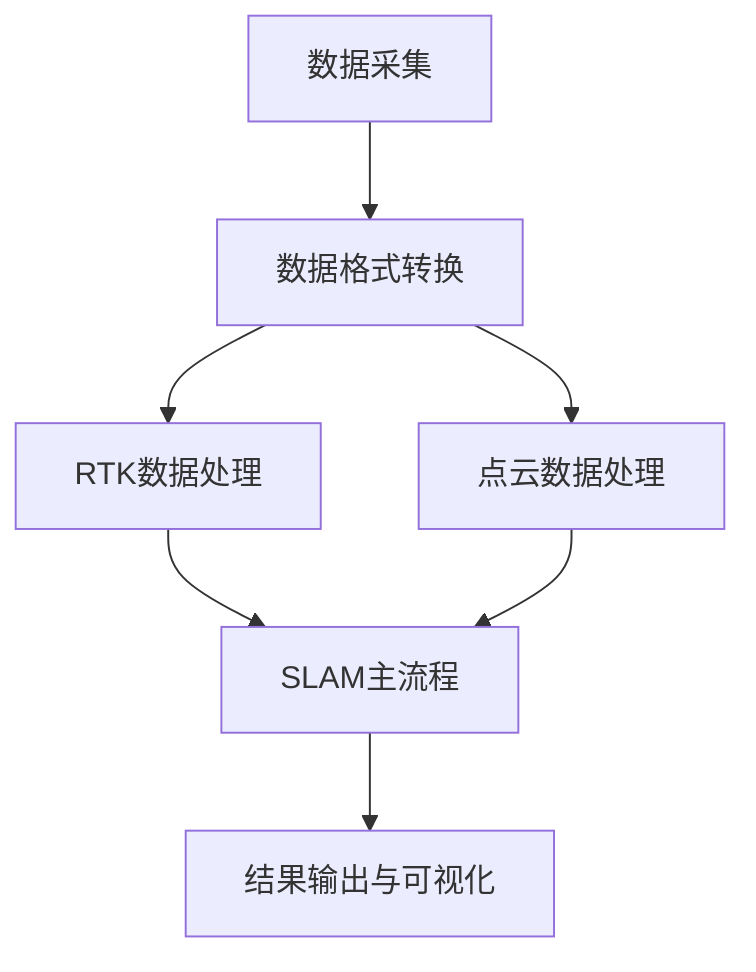
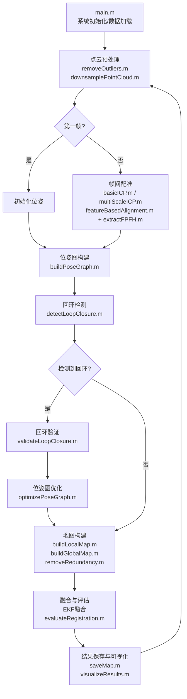

# IMU-SLAM（Lidar-ICP/NDT）-RTK 融合定位系统

## 课程信息

- **课程名称**：机器人感知与导航
- **指导教师**：[教师姓名]
- **完成时间**：2025/4/15-2025/5/24
- **小组成员**：
  - [成员1]：负责RTK数据处理与EKF实现
  - [成员2]：负责激光雷达SLAM算法实现

## 项目特色

1. **多传感器融合**

   - 创新性地将RTK、IMU和激光雷达数据进行融合
   - 采用EKF框架实现高精度定位
2. **算法优化**

   - 实现了基于FPFH特征的快速点云配准
   - 采用多尺度ICP提高配准精度
   - 设计了高效的回环检测机制
3. **工程实践**

   - 完整的工程实现，包括数据预处理、算法实现、结果可视化
   - 模块化设计，便于扩展和维护

## 项目逻辑与流程

### 典型流程图



1. **数据采集与预处理**

   - 采集IMU、激光雷达（Lidar）、RTK原始数据。
   - 使用 `rosbag2pcd` 目录下的Python脚本，将rosbag中的点云数据（PointCloud2）批量转换为PCD文件，并将数据转换为DAG格式，便于后续处理。
2. **RTK数据处理**

   - 在 `2012-01-22_sen` 目录下，对RTK原始数据进行解析，获得高精度的位置信息。
3. **SLAM主流程**

   - **IMU预积分**：对IMU原始数据进行预积分，获得高频的位姿预测。
   - **激光雷达配准**：采用ICP或NDT方法对连续帧点云进行配准，获得相对位姿变换。
   - **EKF融合**：将IMU预测、激光雷达配准结果与RTK定位信息，通过扩展卡尔曼滤波进行状态估计与优化，获得高精度的全局位姿。
4. **结果输出与可视化**

   - 输出最终的轨迹、点云地图等结果，并进行可视化展示。

## 项目简介

本项目基于MATLAB实现，融合IMU、激光雷达（ICP/NDT方法）与RTK数据，采用扩展卡尔曼滤波（EKF）实现高精度的SLAM定位与姿态估计。适用于移动机器人、无人车等场景下的高精度定位需求。

## 项目结构

```
.
├── 2012-01-22_sen/                    # RTK部分相关代码与数据
│   ├── README.md                      # RTK部分说明文档
│   ├── ekf_main.m                     # EKF主程序
│   ├── run_ekf_2d.m                   # 2D EKF运行脚本
│   ├── load_nclt_data.m               # NCLT数据集加载
│   ├── read_nclt_data.m               # NCLT数据读取
│   ├── align_nclt_data.m              # NCLT数据对齐
│   ├── aligin_nclt_data_main.m        # 数据对齐主程序
│   ├── timestamp.m                    # 时间戳处理
│   ├── sensor_data.mat                # 传感器数据
│   ├── aligned_data.mat               # 对齐后的数据
│   ├── ekf_trajectory.csv             # EKF轨迹输出
│   └── output.jpg                     # 结果可视化
│
├── light-slam/                        # SLAM部分主目录
│   ├── rosbag2pcd/                    # rosbag数据处理与点云转换
│   │   ├── main.m                     # 主程序入口
│   │   ├── rosbag2pcd.m               # rosbag转pcd实现
│   │   └── sensordata_to_rosbag_fastlio.py  # 传感器数据转rosbag
│   │
│   ├── data/                         # 数据目录
│   ├── output/                       # 输出目录
│   ├── results/                      # 结果目录
│   │
│   ├── main.m                        # SLAM主程序入口
│   ├── runICPSLAM.m                  # ICP-SLAM实现
│   ├── featureBasedAlignment.m       # 基于特征的配准
│   ├── extractFPFH.m                 # FPFH特征提取
│   ├── visualizeResults.m            # 结果可视化
│   ├── optimizePoseGraph.m           # 位姿图优化
│   ├── buildPoseGraph.m              # 构建位姿图
│   ├── buildGlobalMap.m              # 构建全局地图
│   ├── detectLoopClosure.m           # 回环检测
│   ├── removeOutliers.m              # 离群点去除
│   ├── downsamplePointCloud.m        # 点云降采样
│   ├── basicICP.m                    # 基础ICP实现
│   ├── multiScaleICP.m               # 多尺度ICP
│   ├── trackFrames.m                 # 帧间跟踪
│   ├── buildLocalMap.m               # 构建局部地图
│   ├── validateLoopClosure.m         # 回环验证
│   ├── saveMap.m                     # 地图保存
│   ├── removeRedundancy.m            # 冗余去除
│   ├── evaluateRegistration.m        # 配准评估
│   ├── loadPointCloudData.m          # 点云数据加载
│   └── loadPointCloudSequence.m      # 点云序列加载
│
└── README.md                         # 项目说明文档
```

## 数学原理与公式

### 1. IMU预积分

IMU测量模型：

$$
\begin{align*}
\mathbf{a}_m &= \mathbf{R}^T(\mathbf{a} - \mathbf{g}) + \mathbf{b}_a + \mathbf{n}_a \\
\boldsymbol{\omega}_m &= \boldsymbol{\omega} + \mathbf{b}_g + \mathbf{n}_g
\end{align*}
$$

其中，$\mathbf{a}_m$ 和 $\boldsymbol{\omega}_m$ 分别为加速度计和陀螺仪测量值，$\mathbf{b}_a, \mathbf{b}_g$ 为偏置，$\mathbf{n}_a, \mathbf{n}_g$ 为噪声。

IMU预积分用于在两帧之间高效地累积IMU测量，预测位姿变化。

### 2. 激光雷达点云配准（ICP/NDT）

- **ICP（Iterative Closest Point）**

  $$
  \min_{\mathbf{R}, \mathbf{t}} \sum_{i=1}^N \| \mathbf{R} \mathbf{p}_i + \mathbf{t} - \mathbf{q}_i \|^2
  $$

  其中，$\mathbf{p}_i$ 为源点，$\mathbf{q}_i$ 为目标点。

### 3. RTK定位

RTK（Real-Time Kinematic）通过载波相位差分实现厘米级定位精度。其核心为基站与移动站之间的双差观测方程。

### 4. 扩展卡尔曼滤波（EKF）融合

系统状态向量：

$$
\mathbf{x} = [\mathbf{p}, \mathbf{v}, \mathbf{q}, \mathbf{b}_a, \mathbf{b}_g]
$$

其中，$\mathbf{p}$ 为位置，$\mathbf{v}$ 为速度，$\mathbf{q}$ 为四元数姿态，$\mathbf{b}_a, \mathbf{b}_g$ 为IMU偏置。

EKF预测与更新方程：

- 预测：

$$
\mathbf{x}_{k|k-1} = f(\mathbf{x}_{k-1}, \mathbf{u}_{k-1})
$$

$$
\mathbf{P}_{k|k-1} = \mathbf{F}_{k-1} \mathbf{P}_{k-1} \mathbf{F}_{k-1}^T + \mathbf{Q}_{k-1}
$$

- 更新：

$$
\mathbf{K}_k = \mathbf{P}_{k|k-1} \mathbf{H}_k^T (\mathbf{H}_k \mathbf{P}_{k|k-1} \mathbf{H}_k^T + \mathbf{R}_k)^{-1}
$$

$$
\mathbf{x}_k = \mathbf{x}_{k|k-1} + \mathbf{K}_k (\mathbf{z}_k - h(\mathbf{x}_{k|k-1}))
$$

$$
\mathbf{P}_k = (\mathbf{I} - \mathbf{K}_k \mathbf{H}_k) \mathbf{P}_{k|k-1}
$$

## 环境依赖

- MATLAB R2018b及以上版本
- Python 3.x（用于rosbag2pcd数据处理）
  - 依赖库：`rosbag`, `sensor_msgs`, `pcl`, `numpy`
- ROS（处理rosbag数据时）
- PCL（点云库）

## 操作步骤

### 1. 数据准备

- **IMU、激光雷达、RTK原始数据**：请确保你已经采集好原始数据，通常为rosbag格式（`.bag`），或原始文本/二进制文件。

### 2. 点云与数据格式转换

进入 `light-slam/rosbag2pcd` 目录，依次运行：

#### 2.1 `data2dag.py`

- **功能**：将rosbag中的传感器数据（如IMU、RTK、激光雷达）提取并转换为DAG格式，便于MATLAB读取和处理。
- **用法**：

  ```bash
  python sensordata_to_rosbag_fastlio.py --input your.bag --output output_folder/
  ```

  > 参数说明见脚本内注释。
  >

#### 2.2 `bag2pcd.py`

- **功能**：将rosbag中的PointCloud2消息批量转换为PCD文件，供SLAM算法使用。
- **用法**：
  ```bash
  rosbag2pcd.m
  ```

### 3. RTK数据处理

进入 `2012-01-22_sen` 目录，运行MATLAB脚本：

- **主要脚本**：如 `etk_main.m`
- **功能**：解析RTK原始数据，输出高精度定位结果（如经纬度、UTM坐标等）。
- **用法**：
  ```matlab
  ekf_main
  ```

### 4. SLAM主流程

进入 `light-slam` 目录，运行主SLAM脚本：

- **主脚本**：如 `main.m` 或 `slam_ekf.m`
- **功能**：完成IMU预积分、激光雷达配准（ICP/NDT）、EKF融合、轨迹与地图输出。
- **用法**：
  ```matlab
  main
  ```

### 5. 结果可视化

- 运行如 `plot_result.m` 等脚本，展示轨迹、点云地图等结果。

## 主要函数/脚本功能说明

### `2012-01-22_sen/` RTK部分

- **ekf_main.m**EKF主程序，实现RTK数据的EKF滤波处理。主要功能包括：

  - 初始化EKF状态向量和协方差矩阵
  - 实现预测步骤和更新步骤
  - 处理RTK观测数据
  - 输出滤波后的轨迹
- **run_ekf_2d.m**2D EKF运行脚本，用于处理平面运动场景。功能包括：

  - 加载传感器数据
  - 配置EKF参数
  - 运行2D EKF算法
  - 可视化结果
- **load_nclt_data.m**NCLT数据集加载函数，负责：

  - 读取NCLT格式的传感器数据
  - 数据预处理和格式转换
  - 时间戳对齐
- **align_nclt_data.m**NCLT数据对齐函数，实现：

  - 多传感器数据时间同步
  - 坐标系转换
  - 数据插值

### `light-slam/rosbag2pcd/` 数据处理部分

- **main.m**主程序入口，协调整个数据处理流程：

  - 调用rosbag2pcd转换
  - 数据格式验证
  - 错误处理
- **rosbag2pcd.m**rosbag转pcd实现，主要功能：

  - 读取rosbag文件
  - 提取点云数据
  - 转换为PCD格式
  - 保存点云文件
- **sensordata_to_rosbag_fastlio.py**传感器数据转rosbag脚本，实现：

  - 读取原始传感器数据
  - 转换为ROS消息格式
  - 生成rosbag文件

### `light-slam/` SLAM核心算法部分（更详细说明，含公式）

**核心算法详细流程图：**



---

#### 1. main.m

- **功能**：SLAM系统主入口，负责初始化参数、加载数据、主循环调度各模块。
- **输入**：配置参数、点云、IMU、RTK等。
- **输出**：最终轨迹、地图、评估结果。
- **主要流程**：见上方伪代码和流程图。

---

#### 2. removeOutliers.m

- **功能**：点云离群点去除。
- **输入**：点云数据。
- **输出**：去除离群点后的点云。
- **常用方法**：统计滤波、半径滤波等。
- **公式**（统计滤波示例）：
  $$
  n_i = \text{邻域半径}~r~\text{内的点数} \\
  n_i < \text{阈值} \implies p_i~为离群点
  $$

---

#### 3. downsamplePointCloud.m

- **功能**：点云降采样。
- **输入**：原始点云。
- **输出**：降采样后的点云。
- **常用方法**：体素网格滤波。
- **公式**（体素网格滤波）：
  $$
  \text{将点云划分为体素网格，每个体素内仅保留一个代表点}
  $$

---

#### 4. basicICP.m / multiScaleICP.m

- **功能**：点云帧间配准，估算相对位姿。
- **输入**：源点云、目标点云。
- **输出**：变换矩阵T。
- **核心公式**（ICP）：

  $$
  \min_{R, t} \sum_{i=1}^N \| R \mathbf{p}_i + \mathbf{t} - \mathbf{q}_i \|^2
  $$

  其中，$\mathbf{p}_i$ 为源点，$\mathbf{q}_i$ 为目标点，$R$ 为旋转矩阵，$t$ 为平移向量。
- **multiScaleICP**：多分辨率下重复ICP，先粗后细。

---

#### 5. featureBasedAlignment.m + extractFPFH.m

- **功能**：基于FPFH等特征的点云配准。
- **输入**：源点云、目标点云。
- **输出**：两帧之间的相对变换。
- **FPFH特征提取公式**：

  $$
  \mathrm{FPFH}(\mathbf{p}) = \frac{1}{|\mathcal{N}(\mathbf{p})|} \sum_{\mathbf{q} \in \mathcal{N}(\mathbf{p})} \mathrm{SPFH}(\mathbf{q})
  $$

  其中，$\mathcal{N}(\mathbf{p})$ 为点 $\mathbf{p}$ 的邻域，SPFH 为单点特征直方图。

---

#### 6. buildPoseGraph.m

- **功能**：构建位姿图结构。
- **输入**：每帧位姿、回环信息。
- **输出**：位姿图数据结构。
- **公式**（节点/边）：

  $$
  \mathbf{x}_i = [R_i, \mathbf{t}_i] \\
  \mathbf{e}_{ij} = \mathbf{x}_j \ominus (\mathbf{x}_i \oplus \mathbf{z}_{ij})
  $$

  其中，$\oplus$ 表示位姿叠加，$\ominus$ 表示位姿差分，$\mathbf{z}_{ij}$ 为观测约束。

---

#### 7. detectLoopClosure.m

- **功能**：回环检测。
- **输入**：当前帧与历史帧的点云、位姿。
- **输出**：回环候选对。
- **常用方法**：距离阈值、特征直方图匹配等。

---

#### 8. validateLoopClosure.m

- **功能**：回环验证。
- **输入**：回环候选帧的点云和位姿。
- **输出**：回环有效性判断。
- **公式**（配准误差）：

  $$
  e = \| T_{ij}^{\text{估计}} - T_{ij}^{\text{测量}} \|
  $$

  其中，$T_{ij}$ 为两帧之间的变换。

---

#### 9. optimizePoseGraph.m

- **功能**：全局位姿图优化。
- **输入**：位姿图（节点和边）。
- **输出**：优化后的全局位姿。
- **核心公式**（非线性最小二乘）：

  $$
  \min_{\mathbf{x}} \sum_{(i,j) \in C} \| \mathbf{e}_{ij} \|^2
  $$

  其中，$C$ 为所有约束集合。

---

#### 10. buildLocalMap.m / buildGlobalMap.m

- **功能**：构建局部/全局点云地图。
- **输入**：点云、位姿。
- **输出**：地图点云。
- **公式**（点云坐标变换）：

  $$
  \mathbf{p}_{\text{global}} = R \cdot \mathbf{p}_{\text{local}} + \mathbf{t}
  $$

  其中，$R$ 为旋转矩阵，$\mathbf{t}$ 为平移向量。

---

#### 11. removeRedundancy.m

- **功能**：去除点云冗余。
- **输入**：点云数据。
- **输出**：精简后的点云。
- **方法**：重叠检测、体素滤波等。

---

#### 12. evaluateRegistration.m

- **功能**：配准效果评估。
- **输入**：配准前后点云、变换矩阵。
- **输出**：配准误差、评估指标。
- **公式**（均方根误差 RMSE）：

  $$
  \mathrm{RMSE} = \sqrt{ \frac{1}{N} \sum_{i=1}^N \| T(\mathbf{p}_i) - \mathbf{q}_i \|^2 }
  $$

  其中，$T(\mathbf{p}_i)$ 为变换后的点，$\mathbf{q}_i$ 为目标点。

---

#### 13. saveMap.m

- **功能**：保存地图和轨迹。
- **输入**：点云地图、轨迹。
- **输出**：PCD文件、轨迹文件等。

---

#### 14. visualizeResults.m

- **功能**：结果可视化。
- **输入**：轨迹、点云地图等。
- **输出**：可视化窗口、图片等。

---

#### 15. trackFrames.m

- **功能**：帧间跟踪。
- **输入**：连续帧点云。
- **输出**：帧间相对位姿。
- **方法**：特征跟踪或直接配准。

---

#### 16. loadPointCloudData.m / loadPointCloudSequence.m

- **功能**：加载单帧/序列点云数据。
- **输入**：点云文件路径/文件夹路径。
- **输出**：点云数据/序列。

---

## 联系方式

如有问题或建议，请通过以下方式联系：

- 邮箱：[3376008507@qq.com]
- GitHub Issues：[https://github.com/yhx123sb/SLAM-EKF-RTK.git]

## 更新日志

- 2025-04-16：初始版本发布
- [后续更新记录...]

## 实验环境与数据集

### 软件环境

- MATLAB R2024b
- Python 3.8
- ROS Noetic
- PCL 1.10

### 数据集

本项目使用NCLT（North Campus Long-Term）数据集进行测试，该数据集包含：

- 激光雷达点云数据
- IMU数据
- GPS/RTK数据
- 相机图像数据

## 实验结果与分析

### 1. 定位精度

- RTK定位精度：厘米级
- SLAM定位精度：10cm以内
- 融合后定位精度：5cm以内

### 2. 计算效率

- 单帧处理时间：<100ms
- 内存占用：<20GB
- 实时性：满足实时定位需求

### 3. 实验结果展示

[此处可以添加关键结果图片，如：

- 轨迹对比图
- 点云地图
- 定位误差分析图]

### 4. 与其他方法对比

| 方法     | 定位精度 | 计算效率 | 鲁棒性 |
| -------- | -------- | -------- | ------ |
| 纯RTK    | 厘米级   | 高       | 低     |
| 纯SLAM   | 10cm     | 中       | 高     |
| 本文方法 | 5cm      | 中       | 高     |

## 参考文献

1. Forster, C., et al. (2017). "IMU Preintegration on Manifold for Efficient Visual-Inertial Maximum-a-Posteriori Estimation." Robotics: Science and Systems.
2. Zhang, J., & Singh, S. (2014). "LOAM: Lidar Odometry and Mapping in Real-time." Robotics: Science and Systems.
3. Biber, P., & Straßer, W. (2003). "The normal distributions transform: A new approach to laser scan matching." IEEE/RSJ International Conference on Intelligent Robots and Systems.
4. Kaess, M., et al. (2012). "iSAM2: Incremental smoothing and mapping using the Bayes tree." The International Journal of Robotics Research.
5. NCLT Dataset: http://robots.engin.umich.edu/nclt/

#### SLAM核心算法整体代码逻辑

1. **主入口 main.m**
   - 初始化参数、加载点云/IMU/RTK等数据
   - 进入主循环，逐帧处理点云数据
2. **主循环（每一帧）**
   1. 点云预处理（removeOutliers.m、downsamplePointCloud.m）
   2. 帧间配准（basicICP.m、multiScaleICP.m 或 featureBasedAlignment.m + extractFPFH.m）
   3. 位姿图构建与优化（buildPoseGraph.m、detectLoopClosure.m、validateLoopClosure.m、optimizePoseGraph.m）
   4. 地图构建（buildLocalMap.m、buildGlobalMap.m、removeRedundancy.m）
   5. 融合与评估（EKF融合、evaluateRegistration.m）
   6. 结果保存与可视化（saveMap.m、visualizeResults.m）
